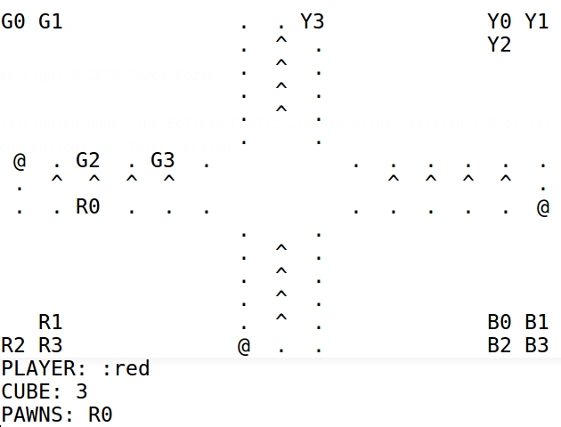

# console-ludo

Ludo game in text mode. The game was written in Clojure :-P

## Usage

- Install lein: https://leiningen.org/
- Inside the root directory type: `lein run`

If you want to run tests type: `lein test`

## License
Copyright © 2019 Paweł Kozak

Distributed under the Eclipse Public License either version 1.0 or (at
your option) any later version.